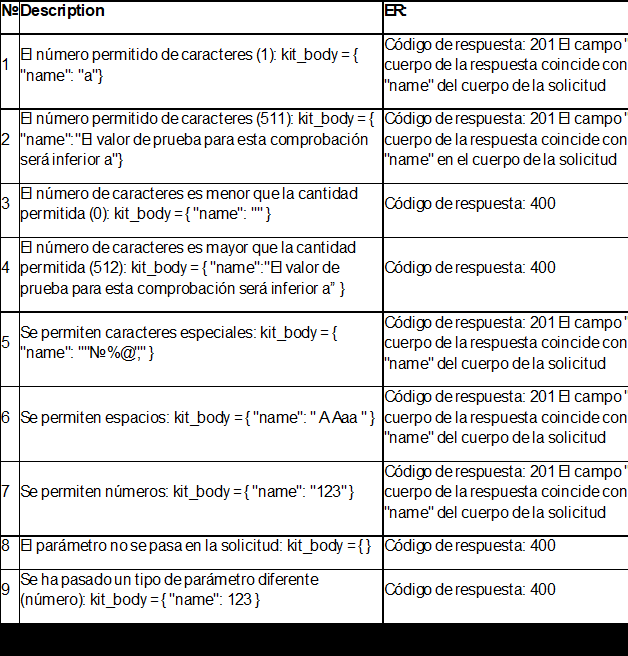

# PROYECTO: CREACION DE KITS URBAN GROCERS 👩‍💻

## Acerca del proyecto 🌐
Estas pruebas automatizadas, se basan en la creacion de un nuevo kit para usuarios a traves de una API.
Este proyecto incluye tambien la creacion de un nuevo usuario y la autenticacion del mismo mediante un autotoken proporcionado por la misma API,ya teniendo el autoToken se puede crear el kit.
El objetivo de estas pruebas es garantizarle al usuario un uso correcto de la API, que los usuarios o usuarias no tengan problema al crear un kit y que el campo solicitado(Que en este caso es name) cumpla con los requisitos especificados por la API.

## Tecnologias Utilizadas 💻

- Pycharm: Entorno de desarrollo integrado (IDE)
- Pytest: Marco de pruebas automatizadas

##  Instalacion del interprete de  
Antes de ejecutar el proyecto, asegurate de tener instalado un interprete de Python en tu sistema.Si no lo tienes
instalado sigue estos pasos ya que es un requisito previo para ejecutar el proyecto.

1. Descarga la ultima version de Python desde el sitio web oficial (https://www.python.org/downloads/)
2. Instala el programa siguiendo las instrucciones proporcionadas durante el proceso de instalacion.
3. Inicia el programa. Para mayor informacion ingresa a este link (https://docs.python.org/es/3/using/windows.html)

## Instalacion y Uso de las librerias 📚 

1. Instala Pycharm desde la pagina oficial. Descarga la version gratuita: Community. (https://www.jetbrains.com/pycharm/download/)
2. Ve a GitHub y clona el nuevo repositorio en tu computadora local, siguiendo estos pasos:
3. Abre la línea de comandos en tu computadora. 
4. Si aún no lo has hecho, crea un directorio para almacenar todos tus proyectos.

``` 
cd ~               # asegúrate de estar en tu directorio de inicio
mkdir projects     # crea una carpeta llamada projects
cd projects        # cambia el directorio a la nueva carpeta de proyectos 
```
5. Clona el repositorio con SSH.
```
git clone git@github.com:username/qa-project-Urban-Grocers-app-es.git
```
💡 Asegúrate de clonar el repositorio correcto. El nombre de usuario debe ser tu propio nombre de usuario.
6. Trabaja con el proyecto de forma local 

Abre PyCharm y selecciona Archivo → Abrir y luego selecciona la carpeta qa-project-Urban-Grocers-app-es que clonaste en tu computadora. 

## Documentacion 📝
 Documentacion completa en apiDOCS [AQUI](https://cnt-30be068b-e4b7-4a9e-8717-b5e7c71f64f7.containerhub.tripleten-services.com/docs/)
 1. Abre la documentacion y busca el apartado de  "Main.Kits" → "Crear un kit"

## Lista de comprobacion utilizada para las pruebas 

```
Valores de prueba para las pruebas 2 y 4

El número permitido de caracteres (511):

kit_body = {    "name":"AbcdabcdabcdabcdabcdabcdabcdabcdabcdabcdabcdabcdabcdabcdabcdabcdabcdabcdabcdabcdabcdabcdabcdabcdabcdabcdabcdabcdabcdabcdabcdabcdabcdabcdabcdabcdabcdabcdabcdabcdabcdabcdabcdabcdabcdabcdabcdabcdabcdabcdabcdabcdabcdabcdabcdabcdabcdabcdabcdabcdabcdabcdabcdabcdAbcdabcdabcdabcdabcdabcdabcdabcdabcdabcdabcdabcdabcdabcdabcdabcdabcdabcdabcdabcdabcdabcdabcdabcdabcdabcdabcdabcdabcdabcdabcdabcdabcdabcdabcdabcdabcdabcdabcdabcdabcdabcdabcdabcdabcdabcdabcdabcdabcdabcdabcdabcdabcdabcdabcdabcdabcdabcdabcdabcdabcdabcdabcdabC"}

El número de caracteres es mayor que la cantidad permitida (512):

kit_body = {  "name":"AbcdabcdabcdabcdabcdabcdabcdabcdabcdabcdabcdabcdabcdabcdabcdabcdabcdabcdabcdabcdabcdabcdabcdabcdabcdabcdabcdabcdabcdabcdabcdabcdabcdabcdabcdabcdabcdabcdabcdabcdabcdabcdabcdabcdabcdabcdabcdabcdabcdabcdabcdabcdabcdabcdabcdabcdabcdabcdabcdabcdabcdabcdabcdabcdAbcdabcdabcdabcdabcdabcdabcdabcdabcdabcdabcdabcdabcdabcdabcdabcdabcdabcdabcdabcdabcdabcdabcdabcdabcdabcdabcdabcdabcdabcdabcdabcdabcdabcdabcdabcdabcdabcdabcdabcdabcdabcdabcdabcdabcdabcdabcdabcdabcdabcdabcdabcdabcdabcdabcdabcdabcdabcdabcdabcdabcdabcdabcdabcD"}
```

## CREDITOS
- Maria Angelica Castillo, Qa engineer - Proyecto - Creacion de pruebas automatizadas